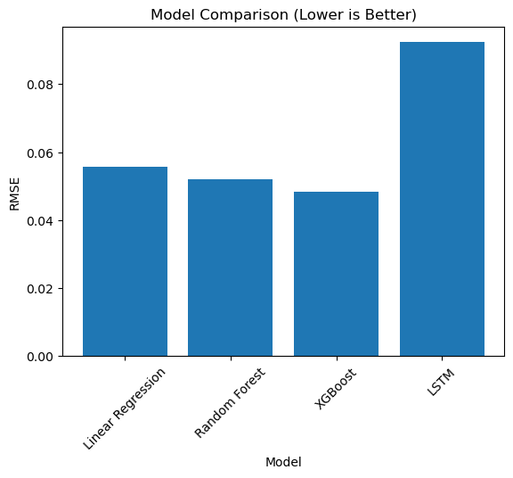

## Comparative Machine Learning Approaches for Ocean Wave Prediction

---

## Project Overview

This project investigates short-term forecasting of Significant Wave Height (WVHT) using multivariate buoy-based meteorological and oceanographic observations.

The objective is to evaluate whether ensemble tree-based methods outperform traditional regression and deep learning architectures under a strict time-series validation framework.

The study emphasizes:

- Proper chronological train-test splitting  
- Persistence baseline benchmarking  
- Seasonal structure analysis  
- Comparative evaluation across model families  

---

## Dataset Description

The dataset consists of time-series measurements recorded by ocean buoys. Variables include:

- Wind Speed (WSPD)  
- Gust Speed (GST)  
- Atmospheric Pressure (PRES)  
- Dominant Wave Period (DPD)  
- Average Wave Period (APD)  
- Water & Air Temperature (WTMP, ATMP)  
- Wind Direction (circularly encoded)  
- Dew Point (DEWP)  

The target variable is:

Significant Wave Height (WVHT), measured in meters.

All timestamp components were merged into a unified datetime index and sorted chronologically to preserve temporal integrity.

---

## Exploratory Analysis

Key observations from exploratory data analysis:

- Strong lag-1 autocorrelation in wave height  
- Consistent seasonal calm period between July and September  
- Nonlinear relationship between wind speed and wave height  
- Persistence provides a strong baseline due to short-term inertia  

These insights informed model selection and feature engineering decisions.

---

## Methodology

### Time-Series Validation

A chronological 80–20 train-test split was implemented to prevent data leakage. Random shuffling was strictly avoided.

### Baseline Model

A persistence model was used as the minimum benchmark:

\[
WVHT_t = WVHT_{t-1}
\]

### Machine Learning Models Evaluated

- Linear Regression  
- Random Forest Regressor  
- XGBoost Regressor  
- LSTM (24-hour multivariate sequence window)  

Tree-based models utilized lag features and seasonal encoding.  
The LSTM model was trained on scaled multivariate sequences.

---

## Results

| Model | R² Score |
|--------|----------|
| Linear Regression | 0.9599 |
| Random Forest | 0.9650 |
| XGBoost | **0.9698** |
| LSTM | 0.8875 |

### Key Findings

- XGBoost achieved the highest predictive performance  
- Ensemble tree-based methods outperformed the LSTM architecture  
- Engineered lag features effectively captured short-term wave inertia  
- Seasonal encoding improved generalization across calm and active periods  

---

## Model Comparison

---

## Technical Insights

- Wave height exhibits strong short-term memory effects  
- Nonlinear meteorological interactions are effectively captured by gradient boosting  
- Deep sequence modeling did not provide additional benefit in this structured tabular setting  
- Model selection should align with data structure rather than architectural complexity  

---

## Future Work

- Multi-step (6-hour and 12-hour ahead) forecasting  
- Extreme wave event modeling  
- Hyperparameter optimization for LSTM  
- Integration with atmospheric forecast data  
- Hybrid physics-informed machine learning approaches  

---

## Technology Stack

Python · Pandas · NumPy · Scikit-learn · XGBoost · TensorFlow/Keras · Matplotlib

---

## Conclusion

This study demonstrates that for structured oceanographic time-series data with strong short-term inertia, ensemble tree-based methods outperform deep sequential architectures.

The findings reinforce the importance of rigorous baselines, proper time-series validation, and data-informed model selection in environmental forecasting problems.
